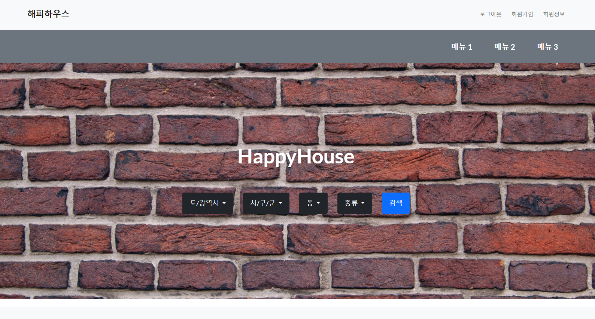
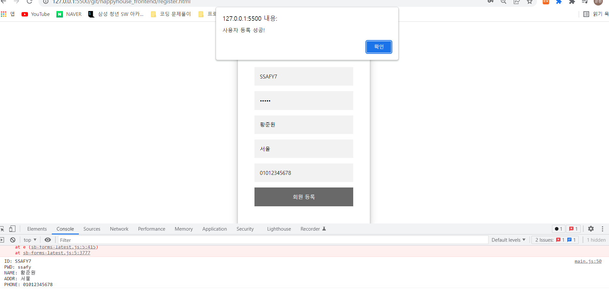
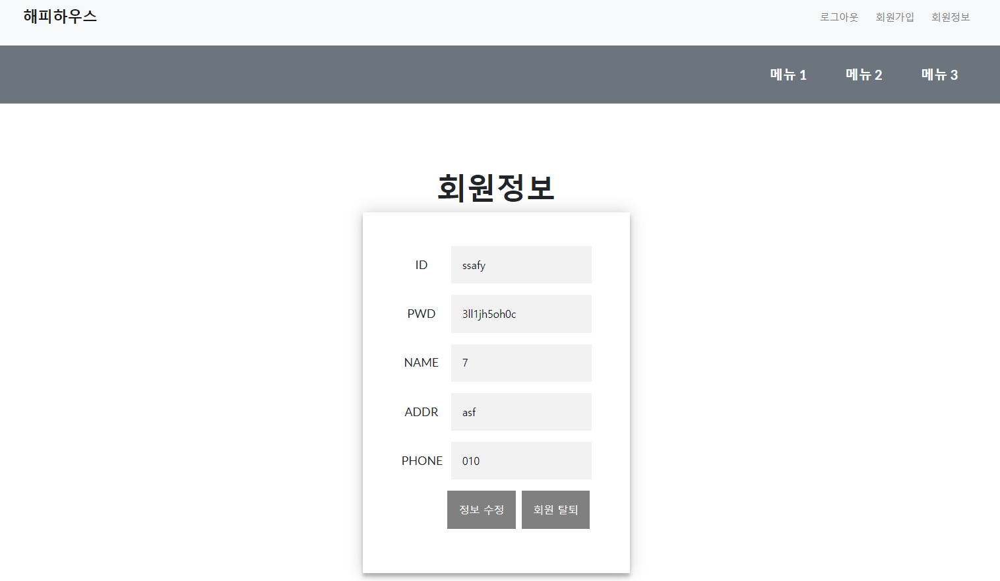
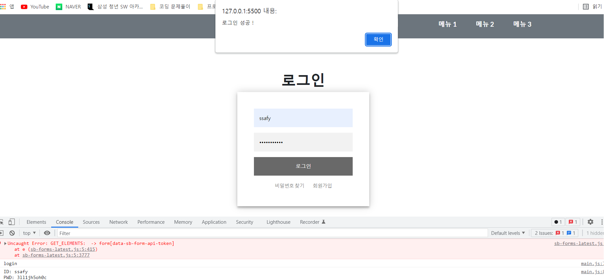
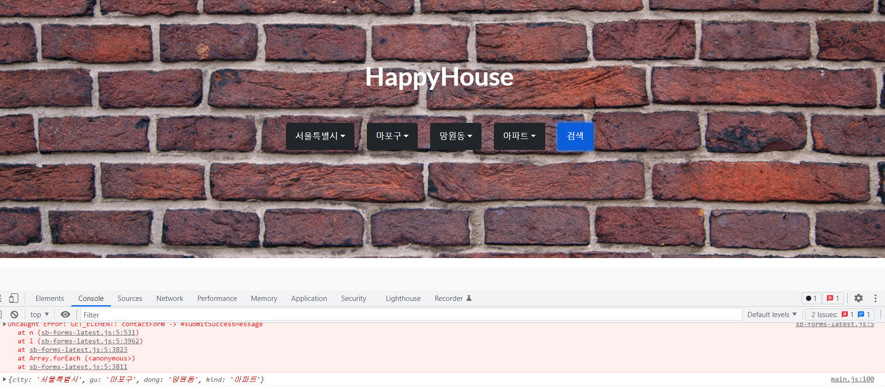
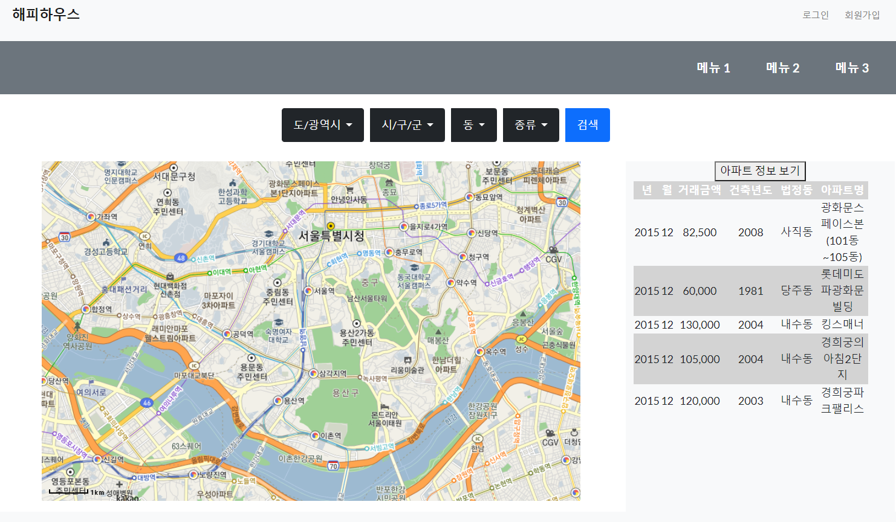

# 관통프로젝트: HappyHouseFrontEnd
### 제출일: 2022.03.14

### 참여 페어
- 황준원(조장), 임재훈

### 처리된 요구사항 목록
  
|난이도|구현기능|세부|작성여부(O/X)|
|:---:|---|---|:---:|
|기본|메인페이지||O|
|기본|회원관리페이지|회원정보 등록화면|O|
|기본|회원관리페이지|회원정보 수정화면|O|
|기본|회원관리페이지|회원정보 삭제화면|O|
|기본|회원관리페이지|회원정보 검색화면|O|
|기본|로그인/로그아웃 페이지||O|
|기본|실거래가 검색,결과 페이지|전체검색화면|O|
|기본|실거래가 검색,결과 페이지|상세조회화면|O|
|기본|실거래가 검색,결과 페이지|동별화면|O|
|기본|실거래가 검색,결과 페이지|아파트별검색화면|O|
|추가|비밀번호찾기||O|
|추가|사이트맵구현||X|
|추가|메뉴구성||O|
|추가|관심지역 동네 업종 정보||X|
|추가|관심지역 대기 오염 정보||X|
|심화|웹사이트 소개 페이지||X|
|심화|공지사항관리 화면||X|
|심화|작성한 페이지 이름 표시||X|

* 작성된 기능은 반드시 캡쳐되어야 합니다.(GUI 실행화면, 콘솔 출력 등) 
* 추가로 구현한 기능을 표에 추가시키세요.

### 실행화면 캡쳐 - 
TODO: 요구사항 목록에서 완료 처리된 사항의 캡쳐 이미지를 등록하세요.

구현 기능: 메인페이지(로그아웃 포함)

- localStorage에 유저 정보, 로그인 상태를 저장해서 로그인 상태에때라 navbar에 로그인 / 로그아웃 및 회원정보가 뜨게 구성했습니다.

구현 기능: 회원가입 페이지

- 아이디, 비밀번호, 이름, 주소, 전화번호를 입력해 회원가입하고 그 정보를 localStorage에 저장합니다.

구현 기능: 회원정보 수정 및 삭제 페이지

- 수정시 localStorage의 정보를 수정하고 삭제시 정보들을 삭제합니다.

구현 기능: 회원 로그인 페이지

- 로그인시에 localStorage에 로그인 상태를 저장해서 화면을 조금 다르게 구성합니다.

구현 기능: 회원 로그아웃 페이지

- 로그아웃시에 로그인 상태를 삭제합니다.

구현 기능: 메인 화면에서 검색

- 드롭다운 버튼을 통해 검색이 가능하고 검색시에 결과화면으로 이동합니다.

구현 기능: 검색 결과 화면 / 지도

- 임시적으로 지도를 표시하고 아파트의 정보들을 옆의 테이블에서 볼 수 있습니다.
