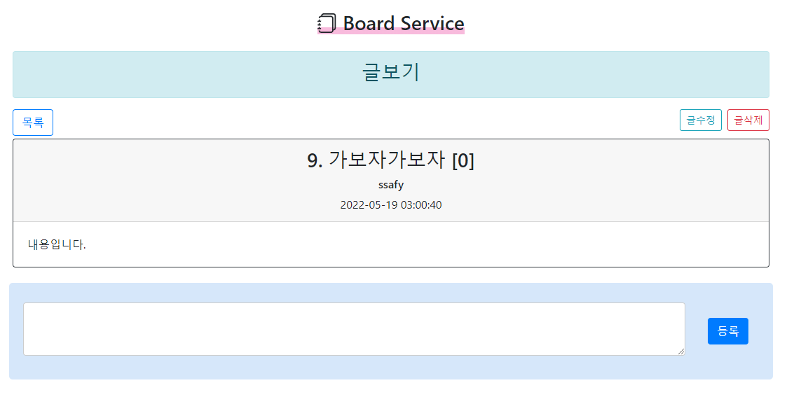
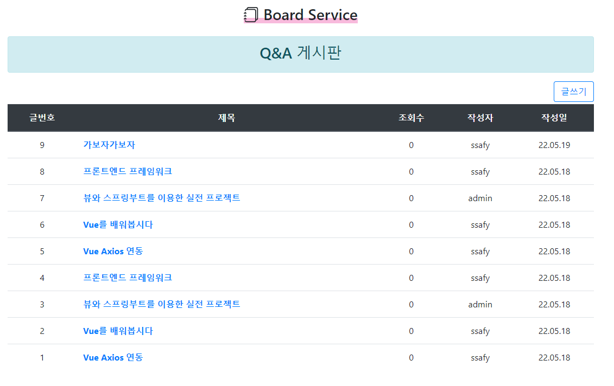
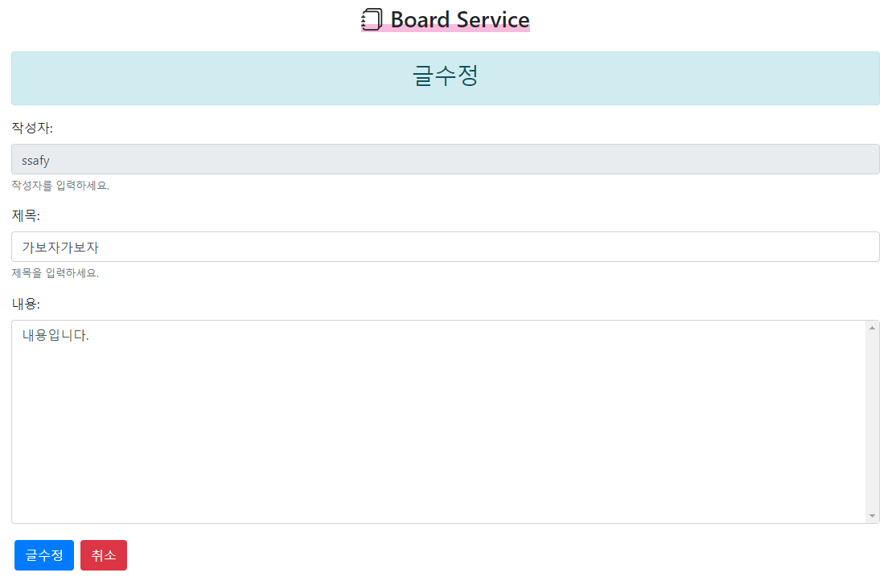
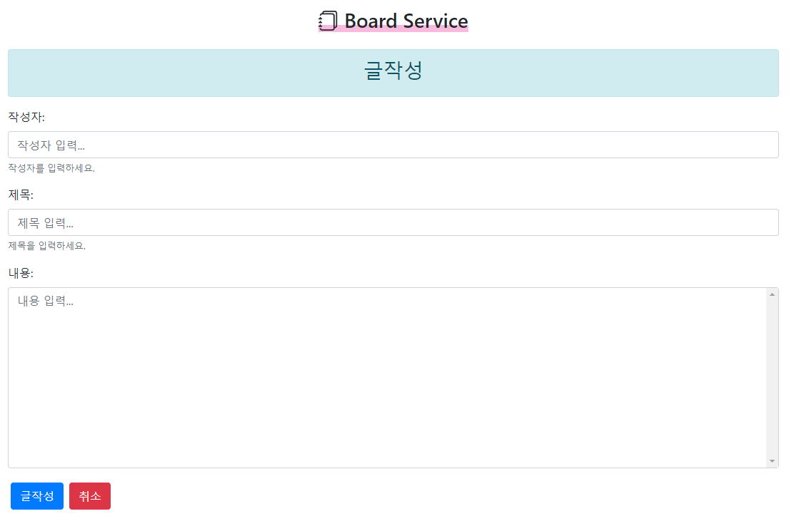
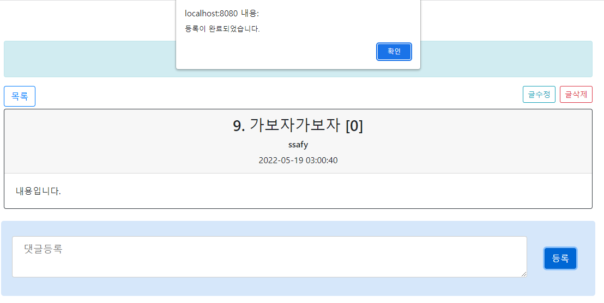
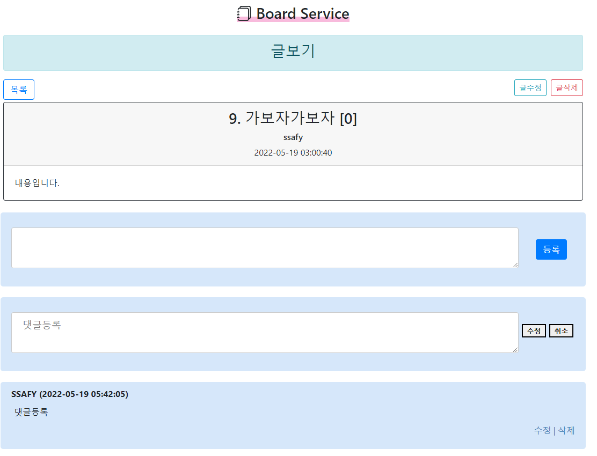
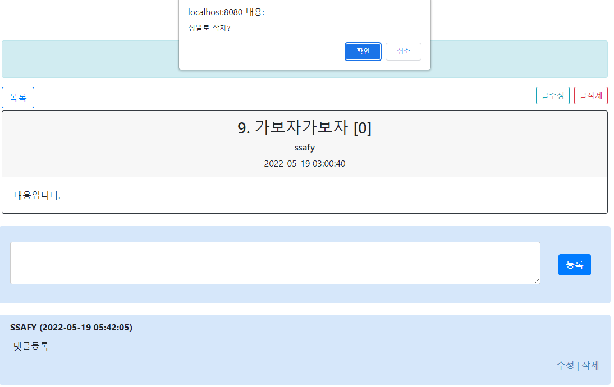

관통 프로젝트 제출 방법

# 관통프로젝트: HappyHouse_Vue
### 제출일: 2022.05.18
### 참여 페어
- 임재훈(조장), 김태하

### 처리된 요구사항 목록
  
|난이도|구현기능|세부|작성여부(O/X)|
|:---:|---|---|:---:|
|기본|QnA 게시판 Vue를 적용한 웹페이지|게시글목록|O|
|기본|QnA 게시판 Vue를 적용한 웹페이지|게시글등록|O|
|기본|QnA 게시판 Vue를 적용한 웹페이지|게시글수정|O|
|기본|QnA 게시판 Vue를 적용한 웹페이지|게시글검색|O|
|기본|서버측 구현|게시글 등록|O|
|기본|서버측 구현|게시글 수정|O|
|기본|서버측 구현|게시글 삭제|O|
|기본|서버측 구현|게시글 상세검색|O|
|기본|서버측 구현|게시글 목록|O|
|추가|동네 업종 정보 조회||X|
|추가|동네 환경 점검 정보 조회||X|
|심화|메인페이지 or 추가 기능||X|

* 작성된 기능은 반드시 캡쳐되어야 합니다.(GUI 실행화면, 콘솔 출력 등) 
* 추가로 구현한 기능을 표에 추가시키세요.

### 실행화면 캡쳐 - 
TODO: 요구사항 목록에서 완료 처리된 사항의 캡쳐 이미지를 등록하세요.

vue 웹페이지와 서버 Controller는 구현하였으나 배포하여 적용은 실패하여 front와 back을 다른 port에서 수행한 결과를 캡처

구현 기능: 질문글 상세 조회

구현 기능: 질문글 목록

구현 기능: 질문글 수정

구현 기능: 질문글 작성

구현 기능: 답변 등록

구현 기능: 답변 수정

구현 기능: 답변 삭제

