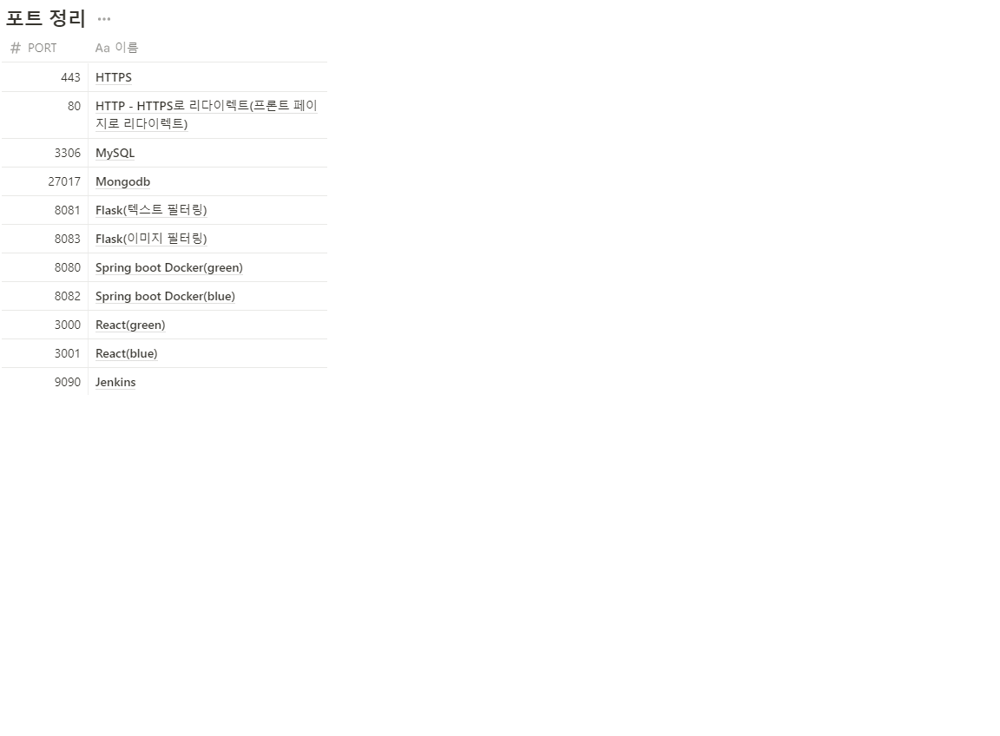

# Hoodies

싸피생에, 싸피생의, 싸피생을 위한 커뮤니티

## 배포

[Hoodies](https://k7a402.p.ssafy.io)

## ✨Overview

싸피 교육 과정을 이수하면서, 싸피 과정 속에서 아쉬운 문제가 있었습니다.

첫 번째 문제는 싸피생만을 위한 다른 교육생들의 이야기를 들을 수 있는 채널이 없다는 점입니다. 매터모스트는 공적인 공간이라 교육생들이 자유롭게 이야기하기에는 제약이 따릅니다, 한편 오픈 카카오톡의 싸피 채널은 싸피 교육생 인증이 불가능 하여 싸피생 만의 커뮤니티라고 보기에는 힘들었습니다..

두 번째 문제는, 싸피 특성상 프로젝트 팀원들과 이야기를 주로 할 수밖에 없다는 점입니다. 2학기 프로젝트 내내 아쉬웠던 점 중 하나는 다른 반 사람들이나 같은 반이어도 다른 조에 소속된 사람들과 이야기를 많이 못해본 것입니다. 싸피 교육생들이 익명으로 이야기할 수 있는 공간이 있다면, 좀 더 교류를 할 수 있지 않았을까요?

세 번째 문제는 매번 바뀌는 컨설턴트님, 실습코치님, 교육프로님들에 대한 정보가 부족하여 다소 낯설게 느껴질 수 있다는 점입니다. 이러한 점은 새로운 반 환경에 적응하는데 많은 시간을 쓰게 하는 한편, 프로젝트를 진행하는 데에 있어서 영향이 갈 수밖에 없습니다.

**이를 싸피생에, 싸피생의, 싸피생을 위한 커뮤니티인 Hoodies를 통해 해결하고자 합니다.**

## 🖼서비스 화면

### 로그인


로그인 화면

### 비밀번호 초기화


### 회원가입


회원가입 화면

### 메인 페이지


메인 페이지 화면 1


메인 페이지 화면 2


메인 페이지 화면 3

### 자유 게시판


자유 게시판 목록 화면

### 익명 게시판


익명 게시판 목록 화면

### 게시 글 필터링


### 게시 글 작성


게시물 작성 화면

### 게시 글 작성 - 코딩 게시판


코딩 게시판 작성 화면

### 게시 글 작성 - 이미지 필터링


### 게시 글 상세


게시물 상세 화면

### 게시 글 상세 - 코딩 게시판


코딩게시판 상세 화면

### 게시 글 좋아요


### 평가 게시판

### 평가 페이지


평가 메인 화면


평가 상세 화면

### 내 정보


### 404 페이지


## 👨‍👩‍👧 Notion

---

`A402 팀 노션 링크`

[https://www.notion.so/seoulhoodiesa402/SSAFY-A402-933ed52594094316ae21e9cc9edd6d58](https://www.notion.so/SSAFY-A402-933ed52594094316ae21e9cc9edd6d58)

모두가 봐야할 공지, 참고 할 링크 등을 모아 관리했습니다. 팀 rule과 컨벤션 규칙을 정하고, flow chart와 ERD와 같은 개발에 필요한 자료들을 정리했습니다.

## ✨ 주요 기능

---

- 서비스 설명 : 삼성 청년SW아카데미 교육생 커뮤니티
- 주요 기능 :
  - Mattermost API를 통한 싸피 교육생 인증 시스템
  - Korea-unsmile-dateset을 통한 텍스트 필터링 기능
  - Google Cloud Vision API를 통한 이미지 필터링 기능
  - 마크다운 에디터를 통한 코딩 게시판 제공
  - 직관적이고 가독성 높은 웹/모바일 UI/UX
  - 사용자가 불편함 없이 쓸 수 있게 하기 위한 무중단 배포

## 🖥️ 개발 환경

---


## 💫 서비스 아키텍처

---


## ✨자동 배포와 SSL 인증서 적용

---

현재 자동 배포를 통해 [k7a402.p.ssafy.io](http://k7a402.p.ssafy.io/) 도메인에 백엔드, 프론트엔드, 텍스트 필터링 서버(flask1), 이미지 필터링 서버(flask)를 모두 연결했고, 모두 자동 배포를 통해 활성화되었습니다. 특히 백엔드와 프론트엔드의 경우 이용자를 고려하여 블루-그린 방식으로 무중단 배포를 구현했습니다.
또한 프론트엔드인 React.js와 백엔드인 Spring은 docker image로 만든 후 docker container를 통해 배포했습니다,. 그리고 Nginx와 letsencrypt를 이용하여 ssl 인증서를 적용했으며, 프론트엔드는 port 443(https)로 분기 했으며, 백엔드는 /api 경로로 프록시를 설정했습니다. 텍스트 필터링 서버는 /ai 경로로, 이미지 필터링 서버는 /cm으로 분기했습니다.

## ✨기술 특이점

---

- **MM 인증시스템**

  싸피생만 가입할 수 있는 커뮤니티를 만들기 위해서는 반드시 인증시스템이 필요했습니다. 싸피생들은 모두 특정한 MM 채널에 소속되어 있기 때문에, Mattermost api를 통해 인증 시스템을 구축할 수 있었습니다.

  가입 시, 가입자 이메일로 실시간으로 MM 메시지 임시 코드가 전송되며 가입자는 전송받은 임시 코드를 가입 입력폼에 입력해야 됩니다. 이러한 방식으로 가입한 교육생들은 모든 Hoodies 서비스를 이용할 수 있습니다.
  구체적인 적용 방식은 다음과 같습니다. mm 메시지를 보낼 사용자 계정 정보를 application.yml에 추가합니다. 그 후 mm 메시지를 받을 사용자의 아이디 입력하고, 이를 통해 보낼 사용자와 받는 사용자와의 다이렉트 채널 주소 획득한 후 메시지를 전송합니다

- **게시판 -** **텍스트 필터링**
  hoodies 팀은 개발하는 데에 있어서 다른 커뮤니티를 많이 참고했습니다. 그러는 도중에 혐오 표현이나 원색적인 욕설이 표현되는 글을 작성하거나 의도적으로 잔인한 이미지 또는 선정적인 이미지를 업로드하는 이용자를 종종 보았습니다. 이는 다른 이용자들이 서비스를 사용함에 있어서 부정적인 영향을 주곤 합니다. hoodies 팀은 텍스트에 관해서는 혐오 표현이 감지될 경우 게시판에서 자동으로 필터 되는 기능을 추가했습니다. 게시글에 혐오 표현이 감지됐을 경우, 어떤 종류의 혐오 표현인지에 대한 라벨을 반환해줍니다. 이를 통해서 어떤 혐오 표현인지 화면에서 볼 수 있으며, 이를 구현하기 위해서 스마일게이트의 Korean UnSmile Dataset을 이용했으며 플라스크를 통해 API 서버로 구축했습니다.

- **게시판 - 이미지 필터링**

  저희 hoodies 팀은 앞선 텍스트 필터링처럼, 이미지 필터링 또한 필요하다고 생각했습니다. 게시글에 부적절한 이미지가 감지됐을 경우, 어떤 유형의 이미지 인지에 대해 값을 반환해줍니다. 이미지 필터 기능을 구현하기 위해서는 구글 비전 API의 Safe Search 기능을 사용했고, Safe Search 기능은 의학용 이미지, 잔인한 이미지, 선정적인 이미지에 대하여 예측 정확도에 따라 5단계로 분류하고 이를 반환해줍니다. 저희 Hoodies 서비스에서는 가장 유해하다고 판단되는 very likely 라벨이 감지되면 이미지 필터가 적용되어 게시할 수 없게 됩니다.

- **이용자를 위한 UI/UX**
  Hoodies 게시판 구성으로는 다른 싸피 교육생과 소통할 수 있는 게시판과 컨설턴트님, 실습코치님, 교육프로님들의 정보를 확인할 수 있는 PRO 페이지로 나눌 수 있습니다. 게시판으로는 이미지를 업로드할 수 있는 자유게시판, 익명으로 자유롭게 소통할 수 있는 익명게시판, 다른 사람의 코드를 볼 수 있는 코딩게시판이 있습니다. 한편 Pro 페이지에서는 실습코치님, 교육프로님들의 전문 분야를 확인하여 싸피 교육생이 컨설턴트에게 더 쉽게 피드백을 받을 수 있고, 실습프로의 다양한 모습을 보는 것을 통해 새로운 반에 더 쉽게 적응할 수 있습니다.

- **배포**
  자동 배포를 위해서 젠킨스를 적용했습니다. 현재 프론트엔드, 백엔드, 이미지 필터링 서버 , 텍스트 필터링 서버 모두 젠킨스를 통해 도커 컨테이너의 도커 이미지로 적용된 상태입니다. 여기서 더 나아가 프론트엔드와 백엔드는 직접적으로 사용자가 사용하는 부분이므로, docker compose를 통해 블루-그린 무중단 배포를 구현하고자 노력했습니다. 블루는 구버전, 그린은 신버전을 의미하며, frontend, backend 브랜치에서 push될 경우 운영중인 구버전과 동일하게 신버전의 인스턴스를 구성한 후 로드밸런서를 통해 모든 트래픽을 한번에 신버전 쪽으로 전환하는 방법을 사용하고 있습니다. 이를 통해 이용자들이 빌드하는 도중에도 hoodies 서비스를 이용할 수 있었습니다..

## 👨‍👩‍👧 협업 툴

---

- `Git`
- `Jira`
- `Notion`
- `Mattermost`
- `Webex`

---

## ✨코드 컨벤션

---

```
- 의미 없는 변수명 X, 최대한 직관적으로 변수명 지어주세요.
	⇒ 유지보수 힘들고, 알아보기 힘드니 반드시 지양해주세요.

- 메서드 이름은 소문자로 시작하고, 동사로 지으면 좋다! ex) getName()

- 변수명, 메서드 이름은 camelCase로 지어주세요

- 클래스 이름은 대문자로 시작합니다

- 리액트 컴포넌트명은 PascalCase로 지어주세요.
```

해당 [Code Convention 가이드](https://udacity.github.io/git-styleguide/), [네이밍 규칙](https://tyboss.tistory.com/entry/Java-%EC%9E%90%EB%B0%94-%EB%84%A4%EC%9D%B4%EB%B0%8D-%EA%B4%80%EC%8A%B5-java-naming-convention)를 참고하여 정했습니다.

## ✨Git 컨벤션

---

```
Feat:    새로운 기능을 추가할 경우
Fix:     버그를 고친 경우
Design:   코드 포맷 변경, 간단한 수정, 코드 변경이 없는 경우
Refacto: 프로덕션 코드 리팩토링
Docs:    문서를 수정한 경우(ex> Swagger)
Rename:  파일 혹은 폴더명 수정 및 이동
Remove:  파일 삭제

```

```
커밋 타입: 수정된 내역 설명
ex) FEAT: admin main page 로직 구성

```

해당 [Git 스타일 가이드](https://udacity.github.io/git-styleguide/)를 참고하여서 정했습니다

## 💡Git Flow 브랜치 전략

---

- Git Flow model을 사용
- 사용한 브랜치
  - feature - 백엔드/프론트엔드 각 기능
  - backend - 백엔드(Spring)
  - frontend - 프론트엔드
  - AI - 백엔드(텍스트 필터링 서버)
  - contentFilter - 백엔드(이미지 필터링 서버)
  - develop - 개발
  - master - 배포
- Git Flow 진행 방식

  1. feature 브랜치에서 기능 개발이 완성되면 [backend or frontend] 브랜치로 pull request를 통해 merge한다.

     ⇒ pull request 시 이상이 없는지 확인하고 merge한다.

  2. backend, frontend 브랜치에서 서로 연결되는 작업 완성 시 develop 브랜치로 pull request를 통해 merge한다.
  3. 다음 배포 버전이 준비되면 master 브랜치로 pull request를 통해 merge한다.

- feature 브랜치 이름 명명 규칙
  - [fe or be]-[git 컨벤션] -[기능 이름]
    ex) fe-feat-adminpage
    ex) be-feat-jwt

## 👨‍👩‍👧 Jira

---

협업 및 일정, 업무 관리를 위해 Jira를 이용하였습니다. 매주 월요일 오전 회의에서 한 주 동안 진행되어야 할 주 단위 계획을 짜고, 진행할 이슈들을 스프린트를 만들어 등록했습니다. 스프린트는 일주일 단위로 진행했습니다. 월요일에 휴일이 많았기 때문에 보통 화요일부터 시작했습니다.

- Epic : BE, FE, 공통으로 나누어 구성하였습니다.
- story : `Epic(FE): 개발 > admin main page 구현` 과 같이 자세하게 작성하였습니다.

story에 예상 시간(story point)을 기록해 더 세세하게 일정 관리를 했고 Mattermost에 알림을 등록하여 작업 상황을 실시간으로 확인할 수 있도록 했습니다.

---

### ✨ ER Diagram

---

- 정규화된 테이블
- 테이블 간 관계 설정
- 게시판 같은 경우 MongoDB이므로 따로 ERD 도출하지 않음


### ✨ EC2 포트 정리

---

[포트 정리](https://www.notion.so/4ce6592eabc746f48098c6cd2050040f)



### 😃 팀원 역할

---

- **오현규(팀장)** - `프론트엔드`, `발표`
  - Jira, Mattermost를 이용한 협업 관리
  - React, CSS, HTML을 이용하여 메인 페이지 로직, 반응형 스타일링 구현
  - 전체 디자인 테마(색상팔레트, 폰트 등) 결정
  - Figma를 사용한 와이어프레임 제작
  - 발표 자료(PPT, 대본) 준비 및 발표
  - UCC 기획, UCC 촬영 및 편집
  - 기타 업무 (교보재 신청, 개인정보 활용 동의서 작성 및 관리, 팀장 미팅 등)
- **김무종(개발팀장)** - `프론트엔드`, `배포`, `AI`
  - react를 통한 프론트엔드 전반적인 로직 구현
  - 프론트엔드 계정 관련 api 연결, 게시판 api 연결
  - 이미지 필터링, 텍스트 필터링 조사 및 적용
  - 이미지 필터링, 텍스트 필터링 API 서버 구축
  - SSL인증서 적용 및 Nginx 초기 설정 적용
  - Jenkins를 통한 백엔드, 프론드엔드. 이미지 필터링 서버, 텍스트 필터링 서버 자동 배포
  - Docker-compose를 통한 블루-그린 방식 무중단 배포 구현(프론트엔드, 백엔드)
  - 포팅 메뉴얼과 Readme와 같은 문서 정리
- **이상현** - `프론트엔드`
  - Figma를 사용한 와이어프레임 제작
  - 로그인, 회원가입 페이지 styled-components를 이용한 스타일링
  - 게시판 페이지 styled-components를 이용한 스타일링 및 반응형 페이지 구성
  - 게시판 페이지의 이미지 업로드, 수정, 표시 구현
  - Sweet Alert2를 이용해 각 페이지 alert및 modal 구현
- **임재현** - `프론트엔드`, `AI`
  - 전체 디자인 테마(색상팔레트, 폰트 등) 결정
  - Figma를 사용한 와이어프레임 제작
  - 평가 게시판 로직 구현 및 api 연결
  - 평가 기능 관련 페이지 스타일링 적용 및 반응형 페이지 구성
  - Google Cloud Vision Content Moderation 기능 구현
  - 스마일게이트 혐오표현 탐지(Hate Speech Detection) 기능 구현
  - AWS S3 bucket, Google Cloud API, Notion Team 사용 환경 준비
  - ⭐404⭐ 페이지 제작
- **임재훈** - `백엔드`
  - Spring boot를 통한 전반적인 게시판 CRUD 로직 작성 및 API 개발
  - MongoDB를 이용한 게시판 기능 관련 DB 아키텍처 설계
  - 게시판 조회수, 좋아요 수 기능 구현
  - 게시판별 키워드 검색 기능 로직 작성
  - 텍스트 필터링을 위해 Flask 서버와의 통신 로직 구현
  - `SHA-256` 해시 알고리즘을 이용한 데이터 암호화
- **조준식**- `백엔드`, `배포`
  - MatterMost 연동 및 회원 서비스 구현(회원가입, 로그인, 비밀번호 초기화)
  - Spring Sercurity를 이용한 인증 및 인가 설정, 관리자 피드백 작성 및 조회 기능 구현
  - JWT를 이용한 Access Token, Refresh Token 인증 구현
  - S3 연동 및 다중 파일 업로드 구현
  - Jenkins 자동 배포 및 무중단 배포 설정(백엔드)
